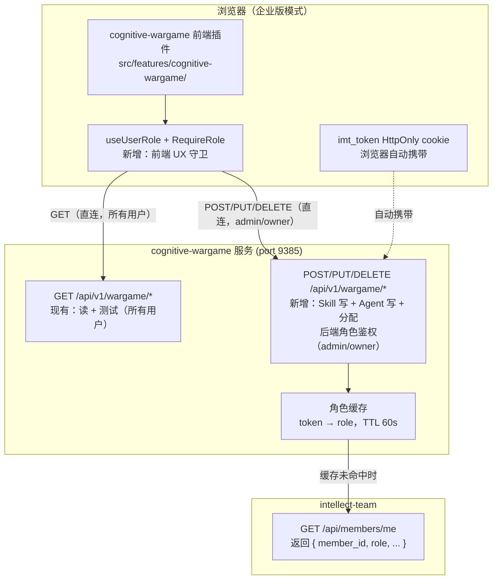
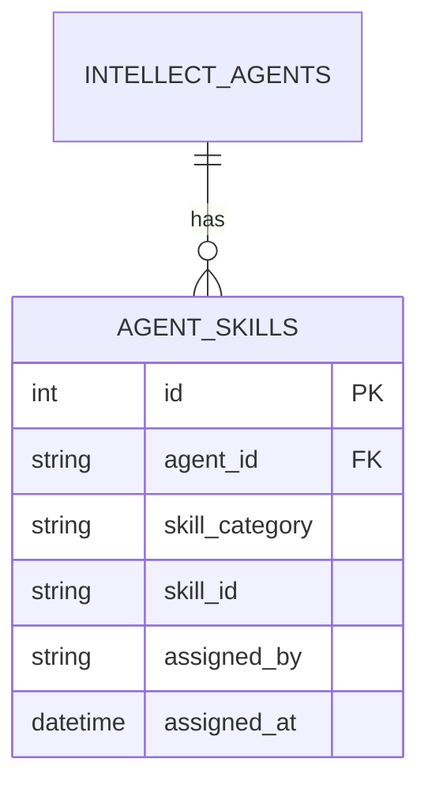

# Cognitive-Wargame 管理操作设计方案

## 1. 设计概述

### 1.1 目标与范围

本方案为 cognitive-wargame 前端插件及其对应的后端 API 增加三类管理能力，仅限 Admin/Owner 角色用户执行写操作：

1. **Skill 管理** — 对 cognitive-wargame 的 6 类 Skill（red-team / blue-team / gray-team / group-agents / person-agents / rule-team）执行增加 / 修改 / 删除 / 测试。Skill 以 `SKILL.md` 为核心，管理操作基于 Markdown 文件内容的读写，不涉及二进制文件上传
2. **Agent 管理** — 对 intellect_agents 注册表执行增加 / 修改 / 删除
3. **Skill-Agent 分配** — 为 Agent 分配或取消分配 Skill

**纳入范围**：

- cognitive-wargame 前端插件（`src/features/cognitive-wargame/`）内的 UI 改造与新增组件
- cognitive-wargame 后端 API（端口 9385，`/api/v1/wargame/*`）需新增的接口契约与角色鉴权

**不纳入范围**：

- BFF（`bff/`）层不做任何改动 — 写操作维持现有直连 `/api/v1/wargame/*` 路径，不经过 BFF 代理
- agentui 通用 Skills 系统（`/files/skills`，基于 Skill Spaces 的那套）不做改动
- canvas/graph agent 的管理不做改动
- cognitive-wargame 后端服务的内部实现（仅给出 API 契约供后端团队对接）

**部署模式限定**：本功能仅支持 intellect-enterprise 企业版模式。社区版（intellect-community）不提供此功能——社区版用户无 role 字段（仅有 `is_superuser` 布尔标记），且 token 经 `Authorization` header 传递而非 HttpOnly cookie，与后端角色校验机制不兼容。前端在社区版模式下隐藏所有管理入口。`[Expert judgment]`

### 1.2 需求追溯

| 编号 | 需求 | 来源 |
|------|------|------|
| R-01 | Admin/Owner 可在 cognitive-wargame 插件中增加/修改/删除 Skill（基于 Markdown 文件编辑，非上传） | 用户原始描述 + 补充确认 |
| R-02 | Admin/Owner 可在 cognitive-wargame 插件中测试 Skill（已有 testSkill API，需保留） | 用户原始描述 |
| R-03 | Admin/Owner 可在 cognitive-wargame 插件中创建/修改/删除 Agent | 用户原始描述 |
| R-04 | Admin/Owner 可为 Agent 分配或取消分配 Skill | 用户原始描述 |
| R-05 | 非 Admin/Owner 用户不可执行写操作，但可浏览 Skill/Agent | 用户原始描述 |
| R-06 | 非 Admin/Owner 用户可查看 Agent 已分配的 Skill 列表（只读） | 用户补充确认 |
| R-07 | 角色判定基于 intellect-team 返回的 role 字段，admin 与 owner 均放行 | 用户原始描述 + intellect-team 代码确认 `[Data-backed]` |

### 1.3 现状分析

**Skill 系统**：cognitive-wargame API（`src/features/cognitive-wargame/api.ts`）当前暴露只读 + 测试接口（`getSkillCategories` / `getSkills` / `getSkillDetail` / `getSkillFileContent` / `testSkill`），无 create/update/delete。Skill 以文件目录形式组织在 6 个固定分类下，每个 Skill 目录必须包含 `SKILL.md`（YAML frontmatter + Markdown body），可选包含 `scripts/`、`references/`、`tests/`、`dashboard/` 等子目录。后端通过目录扫描返回。`resource-overview-page.tsx` 已实现 Skill 浏览、文件预览与测试 UI，但无写操作入口。`[Data-backed]`

**SKILL.md frontmatter 规范**（从 [blue-strategist/SKILL.md](file:///Users/simon/project/cognitive-wargame/src/cognitive_wargame/skills/blue-team/blue-strategist/SKILL.md) 确认）：

```yaml
---
name: blue-strategist          # slug 格式，与目录名一致
description: "..."              # 一句话描述
version: 1.0.0                  # semver
author: cognitive-wargame
license: MIT
platforms: [linux]
metadata:
  intellect:
    tags: [...]
    related_skills: [...]
    model: qwen2.5-72b-instruct
---
# Markdown body...
```

**Agent 系统**：cognitive-wargame API 已有完整 CRUD（`createAgent` / `updateAgent` / `deleteAgent`），`AgentListPage.tsx` 已实现创建/编辑/删除对话框 UI。但当前无任何角色门控——任何登录用户均可执行写操作。`[Data-backed]`

**Skill-Agent 分配**：全代码库无任何 skill-agent 关联机制。AgentRelation 机制仅支持 agent-to-agent 关系（`employed_by` / `spokesperson_of` / `member_of` / `subsidiary_of` / `belongs_to`），不涉及 agent-to-skill 关系。`[Data-backed]`

**角色体系**（从 intellect-team 代码确认 `[Data-backed]`）：

intellect-team 的 `members.role` 字段有 4 个内置值，层级关系由 `Role::level()` 定义：

| role 值 | 层级 | 说明 |
|---------|------|------|
| `owner` | 100 | 完全权限，可管理成员、删除资源 |
| `admin` | 80 | 管理资源、邀请成员（不可删除或踢出成员） |
| `member` | 50 | 默认角色，可使用资源 |
| `guest` | 10 | 只读 |

`/api/members/me` 返回 `{ member_id, display_name, role, email, permissions }`，其中 `role` 直接从数据库 `members.role` 列读取（非 token 内嵌），角色变更后下次调用即生效。企业版登录时该 role 已写入 `localStorage[userInfo]`（见 [auth-hooks.ts:101-110](file:///Users/simon/project/agentui/src/hooks/auth-hooks.ts#L101-L110) 和 [use-login-request.ts:87-97](file:///Users/simon/project/agentui/src/hooks/use-login-request.ts#L87-L97)）。

**企业版 token 传递方式**：企业版模式下 token 存于 HttpOnly cookie `imt_token`，前端 JS 不可读。wargame axios 实例从 `localStorage[Authorization]` 取 token——企业版模式下此值为空，请求实际通过浏览器自动携带 cookie 完成认证。后端校验角色时需同时支持 `Authorization` header 和 `imt_token` cookie 两种取 token 方式。`[Data-backed]`

### 1.4 关键术语

| 术语 | 含义 |
|------|------|
| cognitive-wargame 服务 | 运行在端口 9385 的兵棋推演管理网关，提供 `/api/v1/wargame/*` API |
| intellect-team | 提供 `/api/members/me` 接口的服务，返回成员角色信息 |
| Admin/Owner | intellect-team `members.role` 的两个高权限值，本方案中均拥有管理权限 |
| SKILL.md | Skill 的核心定义文件，YAML frontmatter + Markdown body |

---

## 2. 系统架构

### 2.1 架构总览

所有操作维持 cognitive-wargame 插件直连后端 API 的现有路径。角色鉴权分两层：前端插件内做 UX 守卫（隐藏/禁用写操作入口），后端 API 做安全强制（校验 token 对应的角色）。



前端插件发起请求时，`useUserRole` 从 `localStorage[userInfo]` 读取 role 字段，`RequireRole` 组件据此控制写操作按钮的渲染。写请求经现有 axios 实例直连 `/api/v1/wargame/*`，浏览器自动携带 `imt_token` cookie。后端在处理写操作前从 cookie 或 header 取 token，调 intellect-team `/api/members/me` 校验角色（带 60s 缓存避免每次请求都打 intellect-team）。

### 2.2 为什么不经 BFF 代理

本方案的需求范围限定在 cognitive-wargame 前端插件及对应的后端 API。cognitive-wargame 插件自始即通过独立 axios 实例直连后端服务（[api.ts:5-6](file:///Users/simon/project/agentui/src/features/cognitive-wargame/api.ts#L5-L6) 注释明确说明这一设计意图），不经过 BFF。引入 BFF 代理层会超出需求范围，且破坏现有的直连架构。角色鉴权由后端 API 自身承担——cognitive-wargame 服务调用 intellect-team `/api/members/me` 验证 token 并获取 role，与 BFF 中 `resolveMemberInfo()` 的做法一致。`[Expert judgment]`

### 2.3 前端与后端的角色鉴权分工

| 层 | 职责 | 机制 |
|----|------|------|
| 前端插件 | UX 守卫——非 admin/owner 用户看不到写操作按钮；社区版模式隐藏所有管理入口 | `useUserRole()` 读取 `localStorage[userInfo].role`；`<RequireRole>` 包裹写操作入口 |
| 后端 API | 安全强制——即使绕过前端直接调用 API，非 admin/owner 也会被拒绝 | 写操作接口从 `imt_token` cookie 或 `Authorization` header 取 token，调 intellect-team 获取 role（60s 缓存），非 admin/owner 返回 403 |

前端守卫不承担安全责任（localStorage 可被篡改），仅用于提升用户体验。后端 API 是安全边界。`[Expert judgment]`

---

## 3. 模块设计

### 3.1 前端角色守卫模块

| 要素 | 内容 |
|------|------|
| **职责** | 在 cognitive-wargame 插件内暴露当前用户角色与部署模式，提供声明式 UI 守卫 |
| **输入** | `localStorage[userInfo]`（role 字段）、`localStorage[authMode]`（是否企业版） |
| **输出** | `useUserRole()` 返回 `{ role, canManage, isEnterprise }`；`<RequireRole>` 控制子组件渲染 |
| **依赖** | `authorizationUtil`（读取 localStorage） |
| **边界** | 仅用于 UX（隐藏/禁用按钮），安全保证由后端 API 提供 |

新增 `src/features/cognitive-wargame/hooks/use-user-role.ts`：

```typescript
export function useUserRole(): {
  role: string | null;        // 来自 localStorage[userInfo].role
  canManage: boolean;          // isEnterprise && (role === 'admin' || role === 'owner')
  isEnterprise: boolean;       // localStorage[authMode] === 'intellect-enterprise'
}
```

`canManage` 为 `true` 当且仅当：部署模式为企业版 **且** role 为 `admin` 或 `owner`。社区版模式下 `canManage` 恒为 `false`。

新增 `src/features/cognitive-wargame/components/require-role.tsx`：

```typescript
export function RequireRole({
  fallback = null,
  children,
}: {
  fallback?: React.ReactNode;
  children: React.ReactNode;
})
```

组件内部调用 `useUserRole()`，`canManage` 为 `false` 时渲染 `fallback`（默认 null），为 `true` 时渲染 children。调用方无需手动传入 `canManage`。

### 3.2 Skill 管理模块

| 要素 | 内容 |
|------|------|
| **职责** | 在 cognitive-wargame 插件中提供 Skill 的创建、修改、删除能力，基于 SKILL.md 文件内容的读写 |
| **输入** | Skill 分类、Skill ID、SKILL.md 内容（创建/修改时） |
| **输出** | 操作结果（成功/失败 + 错误信息） |
| **依赖** | cognitive-wargame 后端 API（`/api/v1/wargame/skills/*`） |
| **边界** | 不负责 Skill 搜索/索引；不负责 Skill 测试（已有接口）；不涉及二进制文件上传 |

**Skill 管理操作的范围**：基于现有 Skill 的文件组织方式（每个 Skill 是一个目录，核心是 `SKILL.md`），管理操作聚焦于 SKILL.md 文件的创建/编辑/删除，不涉及目录内其他文件（`scripts/`、`references/` 等）的管理。这是用户补充确认的"基于目前 Markdown 的修改功能"的含义。`[Data-backed]`

**前端 API 客户端**（`api.ts` 新增方法）：

- `createSkill(category, skillId, skillMdContent)` → `POST /api/v1/wargame/skills/:category`（JSON body，非 multipart）
- `updateSkillMd(category, skillId, skillMdContent)` → `PUT /api/v1/wargame/skills/:category/:skillId`（body 含 `skill_md` 字段，语义为"更新 Skill 核心定义"，而非"更新某个文件"）
- `deleteSkill(category, skillId, hard?)` → `DELETE /api/v1/wargame/skills/:category/:skillId`

**前端 UI**（`resource-overview-page.tsx` 改造）：

- Skill 列表区域增加"新增 Skill"按钮，用 `<RequireRole>` 守卫
- 每张 Skill 卡片增加"编辑"/"删除"操作入口，同样守卫
- 新增 `src/features/cognitive-wargame/components/skill-edit-dialog.tsx`——编辑对话框，采用混合方案（§8.1 推荐方案 C），详细设计见下方 §3.2.1

**后端 API 契约**：cognitive-wargame 服务需新增 Skill 写接口并强制 admin/owner 角色，详见 §4。

#### 3.2.1 SKILL.md 编辑器详细设计（方案 C：混合编辑）

**设计目标**：通用字段（name/description/version）用结构化表单输入避免格式错误，差异化字段（`metadata.intellect.*`、`agent.*` 等因 Skill 类型而异的嵌套字段）+ Markdown body 用 textarea 保留灵活性。

**组件结构**：

```tsx
// src/features/cognitive-wargame/components/skill-edit-dialog.tsx

interface SkillEditDialogProps {
  open: boolean;
  mode: 'create' | 'edit';
  category: string;
  skillId?: string;          // edit 模式下有值
  onClose: () => void;
  onSuccess: () => void;     // 保存成功后回调（如刷新列表）
}

// 内部状态
interface SkillFormState {
  skillId: string;           // create 模式可编辑，edit 模式只读
  name: string;              // 只读（自动填充 = skillId）
  description: string;       // 表单输入
  version: string;           // 表单输入
  rawContent: string;        // textarea：frontmatter 剩余字段 + body
}
```

**对话框布局**（参考 [AgentListPage.tsx](file:///Users/simon/project/agentui/src/features/cognitive-wargame/pages/AgentListPage.tsx#L255) 的 Dialog 模式，使用 `@/components/ui/dialog`、`@/components/ui/input`、`@/components/ui/textarea`）：

```
┌─────────────────────────────────────────────────┐
│  DialogTitle: 编辑 Skill / 新增 Skill            │
├─────────────────────────────────────────────────┤
│  ── 通用字段（表单） ──                            │
│  Skill ID:  [____________]  (create 可编辑/edit 只读)│
│  Name:      [____________]  (只读，自动 = skillId)   │
│  Description:                                  │
│  [________________________________________]    │
│  Version:   [____________]  (placeholder: 1.0.0)   │
│                                                 │
│  ── 其余内容（textarea） ──                        │
│  frontmatter 剩余字段 + Markdown body：           │
│  ┌─────────────────────────────────────────┐   │
│  │ author: intellect                        │   │
│  │ license: MIT                             │   │
│  │ platforms: [twitter, facebook]           │   │
│  │ metadata:                                │   │
│  │   intellect:                             │   │
│  │     tags: [...]                          │   │
│  │ ---                                      │   │
│  │ # Skill 正文                             │   │
│  │ ...                                      │   │
│  └─────────────────────────────────────────┘   │
│  (说明：上方表单字段保存时会覆盖此处同名 frontmatter) │
├─────────────────────────────────────────────────┤
│            [取消]  [保存]                        │
└─────────────────────────────────────────────────┘
```

**加载流程**（edit 模式）：

1. 打开对话框时调 `getSkillFileContent(category, skillId, 'SKILL.md')` 拉取原始内容
2. 调 `parseFrontmatter(content)`（复用 [validation.ts](file:///Users/simon/project/agentui/src/pages/skills/validation.ts#L162)）解析得到 `{ metadata, body, valid }`
3. 从 `metadata` 提取 `name`/`description`/`version` 填入表单字段
4. 将 `metadata` 中**剩余字段**（剔除 name/description/version 后）重新序列化为 YAML 片段，与 `body` 拼接后填入 textarea

```typescript
// 加载时的拆分逻辑伪码
const { metadata, body } = parseFrontmatter(rawContent);
const { name, description, version, ...restMetadata } = metadata;
setForm({
  skillId: skillId,         // 来自 props
  name: name || skillId,    // 回退到 skillId
  description: description || '',
  version: version || '',
  rawContent: serializeRemainingFrontmatter(restMetadata) + '\n---\n' + body,
});
```

**序列化逻辑**（`serializeRemainingFrontmatter`）：将 `restMetadata` 对象序列化为 YAML 文本。MVP 阶段可使用简单的手写序列化（处理 string/number/boolean/array/object），或引入 `js-yaml` 库（项目已依赖 yaml 解析，需确认是否已有 `js-yaml`）。序列化失败时回退为原始 frontmatter 全文 + body（即退化为方案 A 纯文本）。

**保存流程**（create/edit 模式一致）：

1. 前端校验：`skillId` 匹配 `^[a-z0-9][a-z0-9_-]*$`；`version` 匹配 semver `^\d+\.\d+\.\d+`（非空时）；`description` 非空
2. 拼接完整 SKILL.md：将表单字段（name/description/version）与 textarea 内容合并

```typescript
// 保存时的合并逻辑伪码
function assembleSkillMd(form: SkillFormState): string {
  // 从 textarea 中解析出剩余 frontmatter 字段 + body
  const textareaParts = splitFrontmatterAndBody(form.rawContent);
  const restMetadata = textareaParts.frontmatter || '';  // YAML 文本片段
  const body = textareaParts.body;

  // 表单字段在前，剩余字段在后，拼成完整 frontmatter
  const headerFields = [
    `name: ${form.skillId}`,              // name 自动 = skillId
    `description: "${escapeYaml(form.description)}"`,
    `version: ${form.version}`,
  ].join('\n');

  const frontmatter = `---\n${headerFields}\n${restMetadata ? restMetadata + '\n' : ''}---\n`;
  return frontmatter + body;
}
```

3. create 模式调 `createSkill(category, skillId, assembledContent)`；edit 模式调 `updateSkillMd(category, skillId, assembledContent)`

**关键边界处理**：

| 场景 | 处理方式 |
|------|----------|
| textarea 中包含 `name`/`description`/`version` 字段 | 保存时表单字段覆盖 textarea 中同名字段（在 `assembleSkillMd` 中跳过 textarea 的这三个字段，仅用表单值） |
| textarea 中无 frontmatter（仅 body） | 拼接时仅用表单字段生成 frontmatter，body 直接附加 |
| edit 模式下原 SKILL.md 无 frontmatter | `parseFrontmatter` 返回 `valid: false`，此时整个内容填入 textarea，表单字段为空，保存时重新生成 frontmatter |
| `parseFrontmatter` 解析失败 | 退化为方案 A：整个 SKILL.md 内容填入 textarea，表单字段为空（用户可手动填写或忽略） |
| `version` 为空 | create 模式下要求必填；edit 模式下若原值为空则允许保持空（兼容历史 Skill 如 [official-voice-strategy](file:///Users/simon/project/cognitive-wargame/src/cognitive_wargame/skills/rule-team/general%20rules/official_voice_strategy/SKILL.md) 仅含 name+description） |

**与现有代码的关系**：

- 复用 [parseFrontmatter](file:///Users/simon/project/agentui/src/pages/skills/validation.ts#L162) 做 frontmatter 解析（仅解析，不用其校验逻辑）
- 复用 [Dialog](file:///Users/simon/project/agentui/src/components/ui/dialog)、[Input](file:///Users/simon/project/agentui/src/components/ui/input)、[Textarea](file:///Users/simon/project/agentui/src/components/ui/textarea)、[Button](file:///Users/simon/project/agentui/src/components/ui/button) 等 UI 组件
- 不复用 [markdown-viewer](file:///Users/simon/project/agentui/src/pages/skills/components/markdown-viewer.tsx)（只读）、[code-viewer](file:///Users/simon/project/agentui/src/pages/skills/components/code-viewer.tsx)（只读）、[prompt-editor](file:///Users/simon/project/agentui/src/components/prompt-editor)（Lexical 富文本，不适用 YAML/Markdown 原始编辑）
- 对话框交互模式参考 [AgentListPage.tsx 的创建/编辑对话框](file:///Users/simon/project/agentui/src/features/cognitive-wargame/pages/AgentListPage.tsx#L255)（open/onClose 状态管理、DialogFooter 布局）

**i18n**：新增 `cognitiveWargame.skills.editDialog.*` 系列 key（title/skillId/name/description/version/rawContent/save/cancel 等），中英文文案同步添加到 [locales/zh.ts](file:///Users/simon/project/agentui/src/features/cognitive-wargame/locales/zh.ts) 和 [locales/en.ts](file:///Users/simon/project/agentui/src/features/cognitive-wargame/locales/en.ts)。

**并发编辑说明**：两个 admin 同时编辑同一 SKILL.md 时采用 last-write-wins，详见 §7.4。

### 3.3 Agent 管理模块

| 要素 | 内容 |
|------|------|
| **职责** | 对现有 Agent CRUD 操作增加角色门控 |
| **输入** | Agent 数据（创建/更新时）、Agent ID（删除时） |
| **输出** | 操作结果 |
| **依赖** | cognitive-wargame 后端 API（`/api/v1/wargame/agents/*`，现有接口） |
| **边界** | 不改变 Agent CRUD 的业务逻辑；不涉及 canvas agent |

Agent CRUD 的 API 和 UI 均已存在（[AgentListPage.tsx](file:///Users/simon/project/agentui/src/features/cognitive-wargame/pages/AgentListPage.tsx) 的创建/编辑/删除对话框，[api.ts](file:///Users/simon/project/agentui/src/features/cognitive-wargame/api.ts) 的 `createAgent` / `updateAgent` / `deleteAgent`）。本模块的工作是：

1. **前端角色守卫**：在 `AgentListPage.tsx` 中用 `<RequireRole>` 包裹"创建"按钮和"编辑"/"删除"操作入口，非 admin/owner 用户不可见。
2. **后端角色强制**：cognitive-wargame 后端的 `POST/PUT/DELETE /api/v1/wargame/agents*` 接口需增加 admin/owner 角色校验。接口本身的请求/响应 schema 不变。

前端 API 客户端无需改动——调用路径维持现有 `/api/v1/wargame/agents`。

### 3.4 Skill-Agent 分配模块

| 要素 | 内容 |
|------|------|
| **职责** | 维护 Agent 与 Skill 之间的多对多分配关系 |
| **输入** | Agent ID、Skill 分类 + Skill ID |
| **输出** | 分配列表 / 操作结果 |
| **依赖** | cognitive-wargame 后端 API（新增 `/api/v1/wargame/agents/:agentId/skills` 接口） |
| **边界** | 不负责 Skill 内容管理；不负责 Agent 属性管理 |

**前端 API 客户端**（`api.ts` 新增方法）：

- `getAgentSkills(agentId)` → `GET /api/v1/wargame/agents/:agentId/skills`
- `assignAgentSkills(agentId, skills[])` → `POST /api/v1/wargame/agents/:agentId/skills`
- `unassignAgentSkill(agentId, skillCategory, skillId)` → `DELETE /api/v1/wargame/agents/:agentId/skills/:skillCategory/:skillId`

**前端 UI**（[AgentDetailPage.tsx](file:///Users/simon/project/agentui/src/features/cognitive-wargame/pages/AgentDetailPage.tsx) 改造）：

- 新增"已分配 Skill"区域，展示当前 Agent 关联的 Skill 列表——**企业版所有用户可见**（非 admin/owner 也可查看）；社区版模式下不渲染此区域
- "分配 Skill"和"取消分配"操作用 `<RequireRole>` 守卫，非 admin/owner 不可见
- 新增 `src/features/cognitive-wargame/components/skill-assign-panel.tsx`——分配面板组件，接收 `canManage` prop 控制操作按钮的渲染

**后端 API 契约**：cognitive-wargame 服务需新增分配接口。查询接口（GET）企业版所有用户可访问；分配/取消接口需 admin/owner 角色，详见 §4。

---

## 4. 接口设计

### 4.1 接口清单

所有接口均为 cognitive-wargame 后端 API（`/api/v1/wargame/*`），由前端插件直连调用。

| 方法 | 路径 | 用途 | 角色 | 状态 |
|------|------|------|------|------|
| GET | `/api/v1/wargame/skills/categories` | 获取 Skill 分类（现有） | 所有用户 | 已实现 |
| GET | `/api/v1/wargame/skills` | 获取 Skill 列表（现有） | 所有用户 | 已实现 |
| GET | `/api/v1/wargame/skills/:category/:skillId` | 获取 Skill 详情（现有） | 所有用户 | 已实现 |
| GET | `/api/v1/wargame/skills/:category/:skillId/files/:filePath` | 获取文件内容（现有） | 所有用户 | 已实现 |
| POST | `/api/v1/wargame/skills/:category/:skillId/test` | 测试 Skill（现有，**新增角色校验**） | **admin/owner** | 占位 |
| **POST** | **`/api/v1/wargame/skills/:category`** | **创建 Skill（写入 SKILL.md）（新增）** | **admin/owner** | 新增 |
| **PUT** | **`/api/v1/wargame/skills/:category/:skillId`** | **更新 SKILL.md 内容（新增）** | **admin/owner** | 新增 |
| **DELETE** | **`/api/v1/wargame/skills/:category/:skillId`** | **删除 Skill（新增）** | **admin/owner** | 新增 |
| GET | `/api/v1/wargame/agents` | 获取 Agent 列表（现有） | 所有用户 | 已实现 |
| GET | `/api/v1/wargame/agents/:agentId` | 获取 Agent 详情（现有） | 所有用户 | 已实现 |
| POST | `/api/v1/wargame/agents` | 创建 Agent（现有，**新增角色校验**） | **admin/owner** | 已实现 |
| PUT | `/api/v1/wargame/agents/:agentId` | 更新 Agent（现有，**新增角色校验**） | **admin/owner** | 已实现 |
| DELETE | `/api/v1/wargame/agents/:agentId` | 删除 Agent（现有，**新增角色校验**） | **admin/owner** | 已实现 |
| **GET** | **`/api/v1/wargame/agents/:agentId/skills`** | **查询 Agent 已分配 Skill（新增）** | **企业版所有用户** | 新增 |
| **POST** | **`/api/v1/wargame/agents/:agentId/skills`** | **批量分配 Skill（新增）** | **admin/owner** | 新增 |
| **DELETE** | **`/api/v1/wargame/agents/:agentId/skills/:skillCategory/:skillId`** | **取消分配（新增）** | **admin/owner** | 新增 |

### 4.2 Skill 写操作接口契约

#### POST `/api/v1/wargame/skills/:category`

创建新 Skill 目录并写入 SKILL.md。请求体为 JSON（非 multipart），仅包含 SKILL.md 文本内容。

| 字段 | 值 |
|------|-----|
| **路径参数** | `category` — Skill 分类，枚举：`red-team` / `blue-team` / `gray-team` / `group-agents` / `person-agents` / `rule-team` |
| **请求体** | `application/json`：`{ "skill_id": string, "skill_md": string }`，其中 `skill_id` 为 slug 格式 `^[a-z0-9][a-z0-9_-]*$`，`skill_md` 为 SKILL.md 完整文本（frontmatter + body） |
| **成功响应** | `201 Created`；body：`{ code: 0, data: { id, name, category, file_count } }` |
| **错误码** | `400 INVALID_SKILL_FORMAT`（skill_id 非法字符、frontmatter 缺 `version` 或 `version` 非 semver）；`409 SKILL_EXISTS`（同名 Skill 目录已存在）；`403 FORBIDDEN`（角色不足）；`401 UNAUTHORIZED` |

后端校验逻辑：校验 `skill_id` 为 slug 格式，解析 frontmatter 校验 `version` 为 semver。前端在提交前自动将 frontmatter 的 `name` 填充为 `skill_id`，后端不强制校验 `name` 与 `skill_id` 一致（保持与 PUT 更新接口相同的宽松策略）。校验通过后在 `skills/:category/:skill_id/` 目录下创建 `SKILL.md` 文件。

#### PUT `/api/v1/wargame/skills/:category/:skillId`

更新已有 Skill 的 SKILL.md 文件内容。路径不含文件名，语义为"更新 Skill 核心定义"，避免与 GET 文件内容接口的 `:filePath` 路径参数混淆。

| 字段 | 值 |
|------|-----|
| **路径参数** | `category`、`skillId` |
| **请求体** | `application/json`：`{ "skill_md": string }`，`skill_md` 为新的 SKILL.md 完整文本 |
| **成功响应** | `200 OK`；body：`{ code: 0, data: { id, name, category, updated_at } }` |
| **错误码** | `404 SKILL_NOT_FOUND`；`400 INVALID_SKILL_FORMAT`（frontmatter 缺 `version` 或 `version` 非 semver）；`403 FORBIDDEN`；`401 UNAUTHORIZED` |

后端校验逻辑：解析 frontmatter，校验 `version` 为 semver 格式。不强制校验 `name` 与 `skillId` 一致——现有 Skill 库中存在目录名与 frontmatter `name` 不一致的历史数据（如 [takaichi-sanae-skill](file:///Users/simon/project/cognitive-wargame/src/cognitive_wargame/skills/person-agents/takaichi-sanae-skill/SKILL.md) 目录的 `name` 为 `takaichi-sanae-account-actions`），强制校验会导致这些 Skill 无法编辑保存。`[Data-backed]`

#### DELETE `/api/v1/wargame/skills/:category/:skillId`

| 字段 | 值 |
|------|-----|
| **路径参数** | `category`、`skillId` |
| **查询参数** | `hard`（可选，boolean，默认 `true` — 直接删除目录） |
| **成功响应** | `200 OK`；body：`{ code: 0, data: { deleted: true } }` |
| **错误码** | `404 SKILL_NOT_FOUND`；`403 FORBIDDEN`；`401 UNAUTHORIZED`；`409 SKILL_IN_USE`（已被 Agent 分配，需先取消分配） |

删除策略采用硬删除（直接移除目录），不提供软删除——Skill 是文件系统目录，软删除（重命名为 `.deleted_` 前缀）会增加 `getSkills`/`getSkillCategories` 的过滤复杂度且无明确需求。被 Agent 分配的 Skill 不允许删除（返回 409），需先取消分配。`[Expert judgment]`

### 4.3 现有写操作接口变更

以下现有接口的路径、请求/响应 schema 均不变，仅后端增加 admin/owner 角色校验：

| 接口 | 变更 |
|------|------|
| `POST /api/v1/wargame/agents` | 后端新增 admin/owner 角色校验；角色不足返回 `403 FORBIDDEN` |
| `PUT /api/v1/wargame/agents/:agentId` | 同上 |
| `DELETE /api/v1/wargame/agents/:agentId` | 同上 |
| `POST /api/v1/wargame/skills/:category/:skillId/test` | 同上——Skill 测试也限制为 admin/owner |

前端需对 Skill 测试入口增加 `<RequireRole>` 守卫。[resource-overview-page.tsx](file:///Users/simon/project/agentui/src/features/cognitive-wargame/pages/resource-overview-page.tsx) 中现有的 `testMutation`（[行 147](file:///Users/simon/project/agentui/src/features/cognitive-wargame/pages/resource-overview-page.tsx#L147)）触发的测试按钮需用 `<RequireRole>` 包裹，非 admin/owner 不可见。

### 4.4 Skill-Agent 分配接口契约

#### GET `/api/v1/wargame/agents/:agentId/skills`

**所有已认证的企业版用户可访问**（含 member/guest 角色）。社区版模式下前端不渲染"已分配 Skill"区域，且社区版 token 无法通过后端的 intellect-team 角色校验。

| 字段 | 值 |
|------|-----|
| **路径参数** | `agentId` |
| **成功响应** | `200 OK`；body：`{ code: 0, data: { agent_id, skills: [{ category, skill_id, skill_name, assigned_at, assigned_by }] } }` |
| **错误码** | `404 AGENT_NOT_FOUND`；`401 UNAUTHORIZED` |

#### POST `/api/v1/wargame/agents/:agentId/skills`

| 字段 | 值 |
|------|-----|
| **路径参数** | `agentId` |
| **请求体** | `{ skills: [{ category: string, skill_id: string }] }`（批量分配，已存在的跳过） |
| **成功响应** | `200 OK`；body：`{ code: 0, data: { assigned: number, skipped: number } }` |
| **错误码** | `404 AGENT_NOT_FOUND`；`400 SKILL_NOT_FOUND`（指定的 Skill 不存在）；`403 FORBIDDEN`；`401 UNAUTHORIZED` |

#### DELETE `/api/v1/wargame/agents/:agentId/skills/:skillCategory/:skillId`

| 字段 | 值 |
|------|-----|
| **路径参数** | `agentId`、`skillCategory`、`skillId` |
| **成功响应** | `200 OK`；body：`{ code: 0, data: { unassigned: true } }` |
| **错误码** | `404 ASSIGNMENT_NOT_FOUND`；`403 FORBIDDEN`；`401 UNAUTHORIZED` |

### 4.5 后端角色校验方式

cognitive-wargame 后端当前不具备调用 intellect-team `/api/members/me` 的能力，需新增 intellect-team HTTP 客户端模块。

**新增 intellect-team 客户端**（后端开发项）：

cognitive-wargame 后端需新增一个 HTTP 客户端模块，用于调用 intellect-team 的 `/api/members/me` 接口。客户端设计要点：

- **配置项**：intellect-team 服务地址（如 `INTELLECT_TEAM_ENDPOINT` 环境变量）、超时阈值（3 秒）、角色缓存 TTL（60 秒）
- **接口签名**（Python 伪码）：

```python
class IntellectTeamClient:
    def __init__(self, endpoint: str, timeout: float = 3.0, cache_ttl: int = 60):
        ...

    async def get_member_role(self, token: str) -> str | None:
        """调 intellect-team GET /api/members/me，返回 role 字段。
        带 60s 内存缓存（key=token），缓存未命中时发 HTTP 请求。
        intellect-team 不可达时返回 None（fail-closed）。"""
        ...
```

- **缓存实现**：进程内内存缓存（如 `cachetools.TTLCache`），key 为 token，value 为 role。无需分布式缓存——角色校验仅用于写操作，每个 wargame 实例独立缓存即可
- **HTTP 库**：复用 wargame 服务现有的 HTTP 库（如 `aiohttp` / `httpx`），避免引入新依赖

**角色校验流程**：cognitive-wargame 后端在处理写操作请求时，按以下顺序取 token：

1. 优先读 `Authorization` header（社区版模式）
2. 缺失时读 `imt_token` cookie（企业版模式）

取得 token 后调 `IntellectTeamClient.get_member_role(token)` 获取 role。若 role 不为 `admin` 或 `owner`，返回 `403 { code: 403, message: 'Forbidden: admin or owner role required' }`。

**角色缓存**：`IntellectTeamClient` 内部以 token 为 key 缓存角色信息，TTL 60 秒（与 BFF [member-id-resolver.ts](file:///Users/simon/project/agentui/bff/src/services/member-id-resolver.ts) 中的缓存策略一致）。用户角色变更后最长容忍 60 秒延迟。`[Expert judgment]`

**intellect-team 不可用时的策略**：fail-closed——若 intellect-team 不可达或超时（3 秒超时阈值），`get_member_role` 返回 `None`，后端拒绝所有写操作，返回 `503 { code: 503, message: 'Role service unavailable' }`。从安全角度不应 fail-open。`[Expert judgment]`

---

## 5. 数据设计

### 5.1 Skill-Agent 分配数据模型

在 cognitive-wargame 后端数据库新增 `agent_skills` 关联表，存储 Agent 与 Skill 的多对多分配关系。



> 注：Skill 是文件系统目录，非数据库表，因此 `agent_skills` 与 Skill 之间无数据库级外键约束。`skill_category` + `skill_id` 的引用完整性由应用层校验（分配时检查目录是否存在，删除 Skill 时检查是否被分配）。

DDL：

```sql
CREATE TABLE agent_skills (
    id             SERIAL PRIMARY KEY,
    agent_id       VARCHAR(255) NOT NULL,
    skill_category VARCHAR(64)  NOT NULL,
    skill_id       VARCHAR(255) NOT NULL,
    assigned_by    VARCHAR(255),
    assigned_at    TIMESTAMP DEFAULT CURRENT_TIMESTAMP,
    UNIQUE(agent_id, skill_category, skill_id),
    FOREIGN KEY (agent_id) REFERENCES intellect_agents(agent_id) ON DELETE CASCADE
);
CREATE INDEX idx_agent_skills_agent ON agent_skills(agent_id);
CREATE INDEX idx_agent_skills_skill ON agent_skills(skill_category, skill_id);
```

**与现有机制的关系**：

- `agent_skills` 与 `AgentRelation`（[api.ts](file:///Users/simon/project/agentui/src/features/cognitive-wargame/api.ts) 中的 `createAgentRelation` / `deleteAgentRelation`）不重复——`AgentRelation` 描述 agent-to-agent 关系（雇佣、隶属等），`agent_skills` 描述 agent-to-skill 分配关系，两者的实体域不同。
- `agent_skills` 与 `Agent.attributes` JSON 字段不重复——`attributes` 是 Agent 的自由扩展字段，`agent_skills` 是结构化的关联表，支持反向查询（"哪些 Agent 使用了某 Skill"）和引用完整性约束。`[Expert judgment]`

联合唯一约束 `(agent_id, skill_category, skill_id)` 防止重复分配。`ON DELETE CASCADE` 确保删除 Agent 时自动清理分配记录。`assigned_by` 记录操作者 member_id，用于审计——GET 接口响应中包含此字段。

**Skill 硬删除时的清理**：当 Skill 被删除时，后端先检查 `agent_skills` 中是否存在引用——存在则返回 `409 SKILL_IN_USE`，不存在则删除目录。这保证了不会产生悬空的分配记录。

### 5.2 Skill 删除策略

采用硬删除（直接移除 Skill 目录），不提供软删除。理由：

- Skill 是文件系统目录，软删除（如重命名为 `.deleted_` 前缀）需修改现有 `getSkills` / `getSkillCategories` 的扫描逻辑，增加复杂度
- 现有 `getSkills` 和 `getSkillCategories` 的调用方（`resource-overview-page.tsx`）依赖目录扫描结果，软删除会改变其行为
- 被分配的 Skill 不允许删除（返回 409），提供了一层保护

`[Expert judgment]`

---

## 6. 影响与迁移

### 6.1 变更清单

| 层 | 文件 | 变更类型 | 说明 |
|----|------|----------|------|
| 前端插件 | `src/features/cognitive-wargame/hooks/use-user-role.ts` | 新增 | 角色读取 hook（含企业版模式判断） |
| 前端插件 | `src/features/cognitive-wargame/components/require-role.tsx` | 新增 | 角色守卫组件（内部调用 useUserRole） |
| 前端插件 | `src/features/cognitive-wargame/api.ts` | 修改 | 新增 Skill 写 + 分配 API 方法 |
| 前端插件 | `src/features/cognitive-wargame/pages/resource-overview-page.tsx` | 修改 | 增加 Skill 创建/编辑/删除 UI + 角色守卫；测试按钮加 `<RequireRole>` 守卫 |
| 前端插件 | `src/features/cognitive-wargame/pages/AgentListPage.tsx` | 修改 | 写操作按钮加 `<RequireRole>` 守卫 |
| 前端插件 | `src/features/cognitive-wargame/pages/AgentDetailPage.tsx` | 修改 | 新增 Skill 分配区域（列表所有用户可见，操作守卫） |
| 前端插件 | `src/features/cognitive-wargame/components/skill-edit-dialog.tsx` | 新增 | SKILL.md 编辑对话框（Markdown 编辑器） |
| 前端插件 | `src/features/cognitive-wargame/components/skill-assign-panel.tsx` | 新增 | Skill 分配面板 |
| 后端 API | cognitive-wargame 服务 | 新增 | Skill 写接口 + 分配接口 + `agent_skills` 表 + 写操作角色校验 |
| 后端 API | cognitive-wargame 服务 | 新增 | `IntellectTeamClient` 模块（调 intellect-team `/api/members/me` 获取 role，含 60s 缓存 + fail-closed） |

**不涉及的文件**：`bff/` 目录下所有文件不做改动；`src/pages/skills/`（通用 Skills 系统）不做改动；`src/pages/agents/`（canvas agent）不做改动；`src/hooks/auth-hooks.ts` 不做改动。

### 6.2 兼容性

- **读操作不受影响**：现有 `getSkills` / `getAgents` / `getSkillDetail` / `getSkillFileContent` 等只读调用路径与行为不变。`getSkills` 和 `getSkillCategories` 的目录扫描逻辑不修改（因采用硬删除，无软删除过滤需求）。
- **Agent 写操作行为变更**：当前非 admin 用户可执行 Agent 写操作（因后端无角色校验），本方案上线后将被后端拒绝（403）。前端会同时隐藏写操作入口。需在发布说明中提示。`[Expert judgment]`
- **前端 API 客户端无破坏性变更**：Agent 写操作的调用路径（`/api/v1/wargame/agents`）不变，仅后端新增角色校验。Skill 写和分配为新增方法，不影响现有调用。
- **社区版模式**：管理入口在前端被隐藏（`canManage` 恒为 `false`），社区版用户不会看到任何变化。若社区版用户绕过前端直接调用写 API，后端因无法从 `imt_token` cookie 取到 token（社区版无此 cookie）且 `Authorization` header 中的 token 对应的 intellect-team 用户 role 非 admin/owner，会返回 403。
- **Cookie 代理转发**：企业版模式下 token 经 `imt_token` HttpOnly cookie 传递。wargame API 在端口 9385，前端通过 Vite dev proxy 或 nginx production proxy 访问。部署时需确认代理正确转发 `imt_token` cookie 至 wargame 服务——Vite dev proxy 需配置 `cookieDomainRewrite`，nginx 需配置 `proxy_pass_header Cookie`。若代理配置遗漏，企业版写操作会因 cookie 丢失而返回 401。

### 6.3 部署顺序

1. cognitive-wargame 后端：新增 `IntellectTeamClient` 模块 + `agent_skills` 表 + Skill 写接口 + 分配接口 + 写操作角色校验
2. 前端插件：部署改造后的 UI

**部署窗口期影响**：步骤 1 部署后，非 admin/owner 用户原来能执行的 Agent 创建/编辑/删除操作将被 403 拒绝，而旧版前端（尚未部署步骤 2）仍向所有用户显示写操作按钮。窗口期内非 admin/owner 用户点击写操作按钮会收到 403 错误。

建议步骤 1 和步骤 2 同时部署以避免窗口期。若无法同时部署，后端角色校验可做成配置开关（如环境变量 `WARGAME_ENFORCE_ROLE=1`），先部署后端但关闭校验，前端部署后再开启。`[Expert judgment]`

---

## 7. 错误处理

### 7.1 角色鉴权错误

| 场景 | HTTP 状态 | 响应体 | 前端处理 |
|------|-----------|--------|----------|
| 未登录（无 token） | 401 | `{ code: 401, message: 'Unauthorized' }` | 现有 axios 401 拦截器跳转登录 |
| Token 无效 | 401 | `{ code: 401, message: 'Invalid token' }` | 同上 |
| 角色不足（非 admin/owner） | 403 | `{ code: 403, message: 'Forbidden: admin or owner role required' }` | Toast 提示"需要管理员权限" |
| intellect-team 不可达 | 503 | `{ code: 503, message: 'Role service unavailable' }` | Toast 提示"角色服务暂时不可用，请稍后重试" |

### 7.2 业务错误

| 场景 | HTTP 状态 | 前端处理 |
|------|-----------|----------|
| SKILL.md frontmatter 校验失败（缺 name/version、name 与 skill_id 不一致） | 400 | 编辑对话框内 inline 展示错误，不关闭对话框 |
| Skill 同名冲突 | 409 | 编辑对话框内提示"该分类下已存在同名 Skill" |
| 删除被分配的 Skill | 409 | Toast 提示"该 Skill 已被 Agent 分配，请先取消分配" |
| Agent 删除失败 | 5xx | Toast 展示后端返回的错误原因 |
| Skill 分配失败 | 400/404 | Toast 展示错误原因，已分配列表回滚到操作前状态 |

### 7.3 前端乐观更新回滚

Skill 分配/取消分配操作采用乐观更新——用户点击后立即更新 UI，请求失败时回滚到操作前状态。使用 TanStack Query 的 `onError` 回调 + `query.invalidate` 确保数据一致性。`[Expert judgment]`

### 7.4 SKILL.md 并发编辑

两个 admin 同时编辑同一 Skill 的 SKILL.md 时，采用 last-write-wins 策略——后保存的覆盖先保存的，先保存者的修改静默丢失。MVP 阶段接受此限制。若后续需要冲突检测，可引入 ETag/If-Match 乐观锁（GET 时返回版本号，PUT 时带上版本号校验）。`[Expert judgment]`

---

## 8. 已确认事项

| 编号 | 问题 | 结论 |
|------|------|------|
| Q-01 | cognitive-wargame 后端是否已具备调用 intellect-team `/api/members/me` 的能力？ | **否**。需新增 `IntellectTeamClient` 模块，详见 §4.5 |
| Q-02 | 一个 Agent 是否可分配同一分类下的多个 Skill？ | **是**。DDL 的 UNIQUE 约束 `(agent_id, skill_category, skill_id)` 允许同分类下多个 Skill，无需调整 |
| Q-03 | SKILL.md 编辑器采用结构化表单还是纯文本编辑？ | **推荐混合方案**，详见 §8.1 |
| Q-04 | Skill 测试接口是否限制为 admin/owner？ | **是**。Skill 测试也仅限 admin/owner，详见 §4.3 |

### 8.1 Q-03 评估：SKILL.md 编辑器方案

现有 SKILL.md 的 frontmatter 结构因 Skill 类型而异：

- **通用字段**（所有 Skill 一致）：`name`、`description`、`version`、`author`、`license`、`platforms`
- **差异化字段**（因 Skill 类型不同）：
  - red-team/blue-team 类：`metadata.intellect.tags`、`metadata.intellect.related_skills`、`metadata.intellect.model`
  - person-agents 类：`agent.account_id`、`agent.language`、`agent.persona_type`、`agent.positioning`、`agent.action_tendencies`、`directory_name`

三种方案对比：

| 方案 | 描述 | 优点 | 缺点 |
|------|------|------|------|
| A. 纯文本编辑 | 单个 `<textarea>` 编辑完整 SKILL.md（frontmatter + body） | 实现简单；兼容所有 frontmatter 结构；admin 可自由编辑任意字段 | 用户需手写 YAML，易格式错误；无字段提示 |
| B. 全结构化表单 | 通用字段用表单输入，差异化字段动态渲染（按 Skill 类型切换字段集） | 用户体验好；字段校验容易 | 实现复杂；需为每种 Skill 类型维护字段映射；新增字段类型需改前端代码 |
| C. 混合方案 | 通用字段（name/description/version）用表单输入并锁定，frontmatter 其余部分 + body 用 textarea 编辑 | 关键字段有结构化输入；差异化字段保留灵活性 | 需拆分/合并 frontmatter；表单字段与文本部分需同步 |

**推荐方案 C（混合方案）**，详细设计见 §3.2.1。理由：

1. 通用字段（`name`、`description`、`version`）是所有 Skill 必需且语义固定的，表单输入可避免格式错误（如 version 非 semver）
2. 差异化字段（`metadata.intellect.*`、`agent.*`）因 Skill 类型而异且可能扩展，强行结构化会限制灵活性
3. `name` 字段在创建时由前端自动填充为 skill_id（见 §3.2），表单中可设为只读
4. 实现复杂度可控——仅需 3 个表单字段 + 1 个 textarea，无需为每种 Skill 类型维护字段映射

**方案 C 的前端实现要点**：

- 编辑对话框分两部分：上部为表单（name 只读、description 多行输入、version 输入），下部为 textarea（frontmatter 剩余字段 + body）
- 加载时：`parseFrontmatter` 解析 SKILL.md，提取 `name`/`description`/`version` 填入表单，剩余 frontmatter 字段 + body 填入 textarea
- 保存时：将表单字段与 textarea 内容重新拼接为完整 SKILL.md（表单字段覆盖 textarea 中同名字段）
- 创建时：name 字段从 skill_id 自动填充且只读，description 和 version 由用户填写，textarea 可为空（仅 body）

若团队倾向更简单的 MVP，可先采用方案 A（纯文本），后续迭代升级为方案 C。方案 C 的详细设计（组件结构、加载/保存流程、边界处理）见 §3.2.1。
